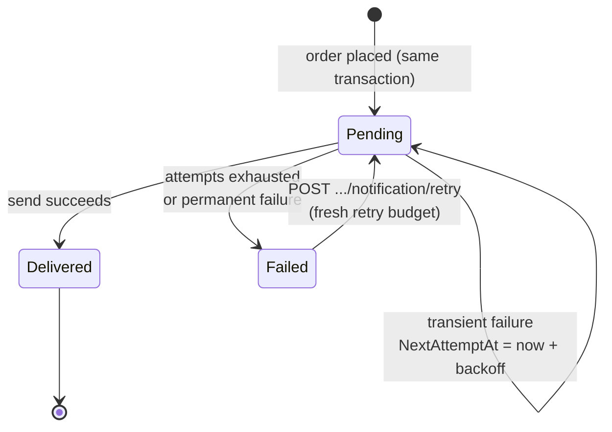

# Architecture

This document explains how the service keeps its guarantees: exactly one order per idempotency key,
atomic order and notification writes, and notification delivery that survives failures. It also
covers the trade-offs behind each choice and how the design scales.

- [Layers](#layers)
- [Placing an order](#placing-an-order)
- [Delivering notifications](#delivering-notifications)
- [Failure analysis](#failure-analysis)
- [The client](#the-client)
- [Scaling](#scaling)
- [Decisions and trade-offs](#decisions-and-trade-offs)

---

## Layers

```mermaid
flowchart LR
    subgraph Api [OrderSubmission.Api]
        E[Minimal API endpoints<br/>problem details, rate limiting,<br/>health, OpenAPI, SPA hosting]
    end
    subgraph App [OrderSubmission.Application]
        H[Command / query handlers<br/>validation + logging decorators]
        P[Ports: repositories, unit of work,<br/>outbox, notification sender]
        D2[Delivery service, retry policy]
    end
    subgraph Dom [OrderSubmission.Domain]
        O[Order aggregate]
        N[Notification aggregate<br/>delivery state machine]
    end
    subgraph Infra [OrderSubmission.Infrastructure]
        EF[EF Core: per-provider contexts,<br/>migrations, repositories]
        OB[Outbox leasing]
        W[Dispatcher + background worker]
        F[Fake sender + fault injection]
    end
    Api --> App --> Dom
    Infra --> App
    Api -. composition root .-> Infra
```



- **Domain** has no dependencies. `Order.Place` enforces invariants and calculates the total.
  `Notification` owns its lifecycle (`Pending → Delivered`, `Pending → Failed → Pending` on manual
  retry) and keeps an attempt history. Infrastructure concerns (lease token, lease expiry) are EF
  *shadow properties* and never appear in the domain model.
- **Application** defines use cases as small CQRS handlers (`ICommandHandler<,>`,
  `IQueryHandler<,>`) wrapped by decorators (validation, then logging), registered with Scrutor.
  Expected failures are `Result<T>` values (`Validation`, `NotFound`, `Conflict`), not exceptions.
- **Infrastructure** implements the ports. Each database engine is a *Strategy*
  (`IDatabaseProvider`): how to register the DbContext, how to recognise a unique-key violation,
  and any one-off preparation. Each provider has its own derived DbContext and migration set.
- **Api** is thin: it maps HTTP to commands and queries, and `Error` values to RFC 9457 problem details.

---

## Placing an order

```mermaid
sequenceDiagram
    autonumber
    participant C as Client
    participant A as API (any instance)
    participant DB as Database
    C->>A: POST /api/orders<br/>Idempotency-Key: K
    A->>A: validate, fingerprint = SHA-256(canonical payload)
    A->>DB: SELECT IdempotencyRecords WHERE Key = K
    alt key already committed
        DB-->>A: record(fingerprint', orderId)
        A-->>C: 200 original order (same fingerprint)<br/>or 409 (different fingerprint)
    else unknown key
        A->>DB: BEGIN; INSERT Order, OrderLines, Notification(Pending), IdempotencyRecord(K); COMMIT
        alt commit succeeds
            A-->>C: 201 Created
        else primary-key violation on K (a concurrent request won)
            DB-->>A: rolled back as a whole
            A->>DB: SELECT IdempotencyRecords WHERE Key = K
            A-->>C: 200 winner's order, or 409 if the payload differs
        end
    end
```

Two properties make this correct under concurrency and across any number of API instances:

1. **The database settles races.** `IdempotencyRecords.Key` is the primary key, so exactly one
   transaction per key can commit. The loser's order and notification roll back with it. There is
   no in-process lock, no distributed lock, and no "in progress" state to expire.
2. **The transaction contains no external I/O.** The notification is only *recorded* (transactional
   outbox), not sent. The whole operation is one short write, so a slow notification provider can
   never hold database locks or make the request path wait.

**Fingerprinting.** The fingerprint is taken over a canonical form of the command, not the raw
body: trimmed strings, prices without trailing zeros, and line order preserved. A retry whose JSON
is formatted differently is therefore still recognised as the same request.

**Keys are only consumed by success.** A request rejected by validation writes nothing, so the client
can fix the payload and reuse the key.

---

## Delivering notifications



**Worker loop.** `NotificationDispatchWorker` runs one cycle after another while there is a
backlog. When idle it sleeps for `PollingInterval`, or less: placing an order on the same instance
signals the worker to wake immediately. The signal only reduces latency, since polling alone is correct.

**Leasing (competing consumers).** One cycle:

1. `SELECT Id … WHERE Status = 'Pending' AND NextAttemptAt <= now AND (lease is null or expired) ORDER BY NextAttemptAt` (index seek)
2. `UPDATE … SET LeaseToken = @mine, LeaseExpiresAt = now + LeaseDuration WHERE Id IN (…) AND <still available>`.
   The update re-checks availability, so a row claimed by another worker in between is skipped.
   A single conditional `UPDATE` is atomic per row on every relational engine, so this needs no
   engine-specific locking hints.
3. `SELECT Id WHERE Id IN (…) AND LeaseToken = @mine` returns what this worker actually won.

Each leased notification is then delivered in parallel (`MaxConcurrency`), each in its own DI scope
and DbContext:

- The send runs with a `SendTimeout` that is shorter than the lease.
- The outcome is recorded by the domain (`RecordDelivery` / `RecordFailure`). The retry time comes
  from `IRetryPolicy`: capped exponential back-off with jitter.
- `CompleteAsync` saves with `LeaseToken` as the **optimistic concurrency token**
  (`UPDATE … WHERE Id = @id AND LeaseToken = @mine`) and clears the lease. If the worker stalled
  past its lease and another worker took over, this update matches no row and the stale outcome is
  discarded.

**Delivery semantics.** Delivery to the provider is *at least once*: a worker can crash after the
provider accepted a message but before recording it. The recorded outcome is exactly once. The
stable `NotificationId` travels with every attempt so a real provider can de-duplicate. This is the
standard outbox trade-off, and it is the correct one: at-most-once would lose confirmations.

**Fault injection.** `FaultInjectingNotificationSender` is a decorator in front of the sender port.
It adds latency and throws transient failures based on `INotificationServiceSimulator` (`Healthy`,
`Flaky` with a rate, or `Outage`). Configuration sets the start-up behaviour; the API and UI change
it at runtime. Because it wraps the port and not the fake, the same decorator could sit in front of
a real provider in a staging environment for chaos testing.

---

## Failure analysis

| What fails | What happens |
|---|---|
| Client times out or loses the response | It retries with the same key and receives the original order (`200`, replayed) |
| Double click, retry storm, many instances receive the same key | One transaction commits; the others hit the primary key and replay the winner (`200`) or get `409` if the payload differs |
| Process crashes before commit | Nothing was written; the retry creates the order |
| Process crashes after commit, before responding | The retry is a replay |
| SQL Server transient fault during commit | EF retries (`EnableRetryOnFailure`). If the first commit had in fact succeeded, the retry hits the key constraint and replays: still one order |
| Notification service down | The notification stays `Pending` and is retried at 2s, 4s, 8s … (capped, jittered); the order is unaffected |
| Down for longer than the retry budget | `Failed`, kept, visible in `GET`, and re-queueable via API or UI |
| Worker crashes mid-send | The lease expires and another worker (or the same one after restart) retries |
| Worker stalls beyond its lease | Another worker takes over; the stale worker's write fails the lease-token check |
| Database briefly unavailable to the worker | The cycle is logged and retried after the polling interval; the worker stays alive |
| Validation bypassed (bug) | Domain invariants throw `DomainException`, mapped to `400` |

---

## The client

Angular 22 with standalone components, signals, zoneless change detection, OnPush everywhere and
lazy-loaded routes.

```
client/src/app/
  core/                      http (problem details → ApiError, transient retry), browser (safe storage, clock)
  features/orders/
    data-access/             OrdersApi, OrderSubmissionStore, OrderTracker, RecentOrdersStore, IdempotencyChecks
    ui/                      order-form, order-summary, confirmation-status, recent-orders
    pages/                   new-order-page (/), order-page (/orders/:id, the confirmation page)
  features/test-tools/       Test tools panel: messaging simulation, duplicate-request checks, request details
  features/simulation/       simulation API store
  shared/ui/                 icon, status pill, formatting pipes
```

**Idempotency on the client** (`OrderSubmissionStore`):

- A key is created when a submission is first sent, not when the form opens.
- Every retry of that submission reuses the key: automatic retries on network errors, 408, 429 and
  502–504 (exponential back-off), the manual **Retry** button, and a retry after a **page reload**
  (the pending submission is persisted to `localStorage`).
- If the user edits the order after an unconfirmed attempt, the next submit is a new request with a
  new key, and the key stub says so.
- A definitive answer releases the key: success, `400` or `409`. Unknown outcomes (network failure,
  `5xx`) keep it.
- The button is disabled while a request is in flight, and the form is locked after success, so a
  double click cannot create a second order.

**Delivery tracking** polls adaptively: at most once a second while an attempt is due, waiting until
just after `nextAttemptAt` during back-off, and stopping entirely at `Delivered` or `Failed`.

**Design.** The ordering flow uses the customer's language. The form has product suggestions that
fill in prices, quantity steppers and field-level errors. The confirmation page shows a short order
number and a plain status for the confirmation message (*Sending*, *Confirmation delayed*, *Sent*,
*Not sent*), and says that the order itself is safe when only the message is late. Nothing technical
appears in that flow: idempotency keys, HTTP status codes and the failure simulator live in a
separate **Test tools** panel, and the header shows a warning chip whenever the simulated messaging
service is not working. Text is set in Schibsted Grotesk, with Martian Mono only for identifiers and
keys; there is one cobalt accent, and green, amber and red are reserved for status. Fonts are
self-hosted. Light and dark themes follow the OS, inputs are 16px with 44px touch targets, and every
page works at phone width.

---

## Scaling

**Request path.** A `POST` is one primary-key lookup plus one transaction inserting four kinds of
row. A `GET` is two index seeks with no-tracking projections. Neither calls anything external. API
instances are stateless, and pooled DbContexts keep per-request allocation low.

**Horizontal scale.**

| Tier | How it scales | Coordination |
|---|---|---|
| API | Add instances behind a load balancer | None: idempotency is enforced by the database key |
| Delivery workers | Add instances; tune `BatchSize` × `MaxConcurrency` | Leases (conditional update + concurrency token) |
| Database | Vertical first, then read replicas for `GET`, then partitioning | — |

`Notifications:Dispatcher:Enabled` separates the roles: API nodes with it off, worker nodes with it
on, from the same image.

**Database.** SQLite is for development (single writer). For production, SQL Server is provided and
tested:

- A binary collation makes the key case-sensitive.
- A filtered index covers `Status = 'Pending'`, so the outbox scan stays small as delivered rows accumulate.
- Transient-fault retries are enabled.

UUIDv7 keys are time-ordered, which keeps index inserts append-mostly. EF Core's migration lock makes
concurrent start-ups safe; in production, apply migrations as a release step
(`ApplyMigrationsOnStartup=false`).

**Beyond a single database** (the next steps, in order of need):

1. **Outbox relay to a broker.** For very high volume, stream outbox rows (CDC or a single-statement
   `UPDATE TOP (n) … WITH (READPAST, UPDLOCK) OUTPUT`) to Kafka or Service Bus. Consumers then fan out
   to email, SMS and push. The write path does not change.
2. **Push instead of polling.** Server-sent events or SignalR with a Redis backplane for live
   delivery status.
3. **Partitioning.** Scope idempotency keys per client or tenant (`(TenantId, Key)`), and shard
   orders, outbox and keys by customer so each order's transaction stays on one shard.
4. **Retention.** A TTL job for idempotency records (index on `CreatedAt` is already present) and
   archiving of delivered notifications.
5. **Edge protection.** Move rate limiting to the gateway. The in-app per-IP limiter shows the
   policy but is per instance.

**Operations.** Health endpoints (`/health/live`, and `/health/ready` which checks the database),
graceful shutdown (in-flight leases simply expire), options validated at start-up, source-generated
structured logging, and a `traceId` on every error. Next: OpenTelemetry traces and metrics for
orders placed, replays, conflicts, outbox age and failed deliveries, with alerts on the last two.

---

## Decisions and trade-offs

| Decision | Why | Alternative considered |
|---|---|---|
| Idempotency record in its own table, keyed by the idempotency key | Keeps HTTP-level idempotency out of the Order aggregate; enables retention without touching orders | Unique `IdempotencyKey` column on `Orders`: simpler, but mixes concerns |
| Database constraint as the arbiter | Correct across instances with no extra infrastructure | Redis lock or "in-progress" record: more moving parts and expiry edge cases, and unnecessary when the operation is one short transaction |
| Fingerprint of the canonical command | Formatting-insensitive, transport-independent | Hash of the raw body: false 409s on harmless formatting differences |
| Replay returns current order state | The order is immutable; clients benefit from live delivery status | Storing and replaying the exact first response: byte-identical, but stale |
| Notification table *is* the outbox | Delivery status is queryable per order, which `GET` needs | Generic outbox of serialized domain events: more flexible, one more hop to answer "was it delivered?" |
| Lease + concurrency token | Engine-neutral and safe under stalls | `SKIP LOCKED` / `READPAST`: faster, but engine-specific (noted as a scaling step) |
| Manual re-queue after `MaxAttempts` | Poison messages stop retrying automatically, but a failure is never final | Infinite retries: simpler, but noisy and hides persistent problems |
| Per-provider DbContext and migrations | Each engine gets native types (`datetimeoffset`, `decimal(18,2)`) and features (filtered index, collation) | One migration set for both: forces lowest-common-denominator types |
| Minimal APIs + hand-rolled CQRS handlers | Small, explicit, no commercial dependencies | MediatR (now commercially licensed) or controllers |
